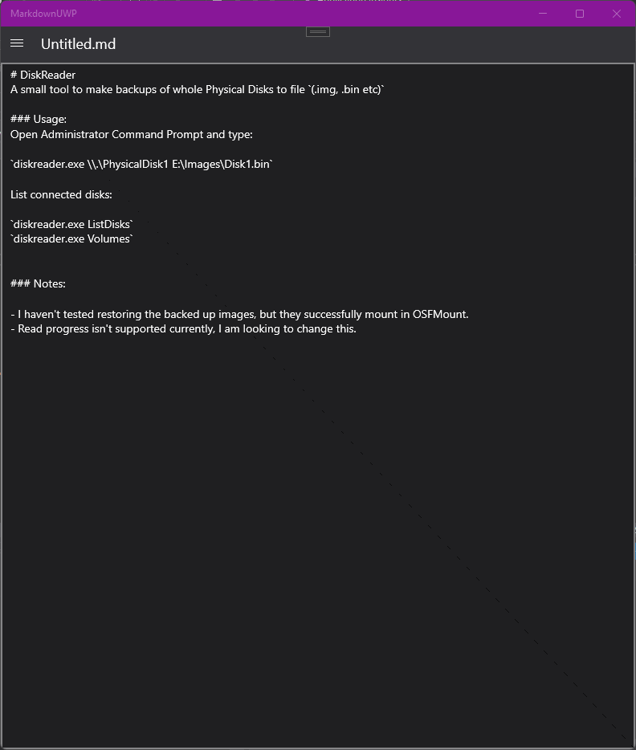
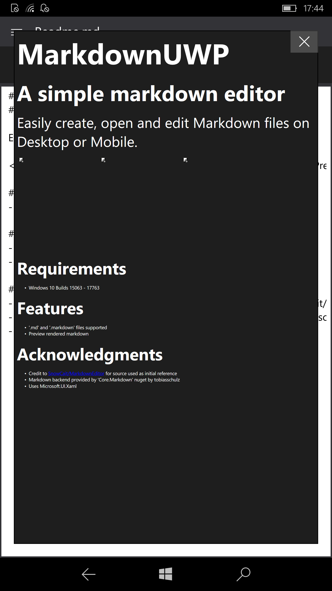
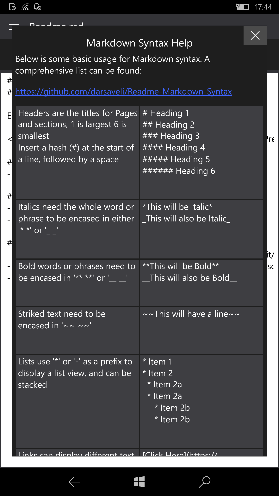

# MarkdownUWP
## A simple markdown editor

Easily create, open and edit Markdown files on Desktop or Mobile.

  

### Requirements
- Windows 10 Builds 15063 - 17763

### Features
- '.md' and '.markdown' files supported
- Preview rendered markdown

### Acknowledgments
- Credit to [SnowCait/MarkdownEditor](https://github.com/SnowCait/MarkdownEditor) for source used as initial reference
- Markdown backend provided by 'Core.Markdown' nuget by tobiasschulz
- Uses Microsoft.UI.Xaml
